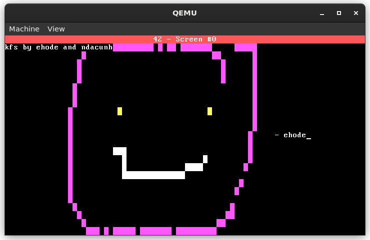

# kfs

`kfs-1` implements the early foundations of an operating system, including a working interrupt system, hardware input handling, and VGA-based rendering. The codebase is structured using namespaces and structured types to maintain clarity and modularity.

## Features

### Kernel Panic

* `kernel_panic()` displays a full-screen red VGA error screen
* Shows a custom error message
* Triggered by critical exceptions such as divide-by-zero

### Interrupt Descriptor Table (IDT)

* Fully implemented IDT
* Divide-by-zero handler triggers a kernel panic

### Hardware Interrupts (IRQ)

* **Timer (IRQ0)**

  * System tick counter
  * Time tracking in milliseconds and seconds since boot

* **Keyboard (IRQ1)**

  * Handles key input
  * Allows basic text input on screen

* **Mouse (IRQ12)**

  * PS/2 mouse support
  * Packet parsing
  * Cursor movement and basic drawing support

### Multi-Screen Management (Bonus)

* Support for multiple virtual screens (F1–F4)
* Each screen stores:

  * VGA buffer state
  * Cursor position
* Allows switching between independent screen contexts

### VGA Screen System

* Direct manipulation of VGA text buffer
* Support for writing and drawing operations

### System Architecture

* Clean modular design using namespaces and structured types
* Separation of concerns across hardware, interrupts, and UI layers

### Debug & Utilities

* Serial output for debugging (`serial_print`)
* Formatted printing (`sprintf`, `vsprintf`)